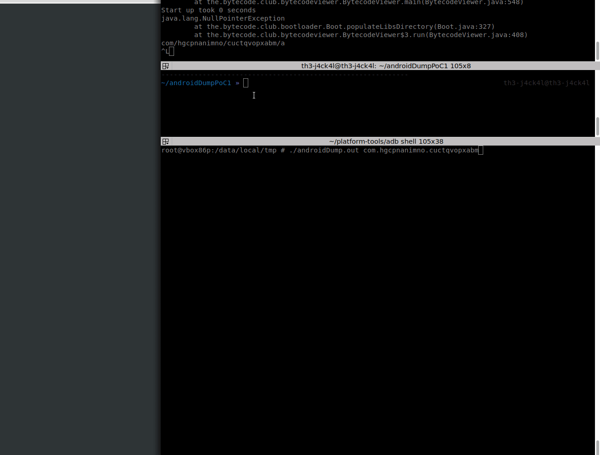

# androidDump

This tool pulls loaded binaries ordered by memory regions, if application doesn't have root access, application dumps its own files in its region which name included in maps table

```
 |======================================================== SAMPLE DATA ==============================================================================|
vbox86p:/data/local/tmp # cat /proc/1942/maps | grep com.e
  d65ca000-d6649000 r--p 00000000 08:13 82157                              /data/data/com.eognikznmvsc.ucjykvjwsgf/app_files/evqyuxlwl.dex (deleted)
  d6649000-d66bd000 r-xp 0007f000 08:13 82157                              /data/data/com.eognikznmvsc.ucjykvjwsgf/app_files/evqyuxlwl.dex (deleted)
  d66c2000-d66c3000 r--p 000f3000 08:13 82157                              /data/data/com.eognikznmvsc.ucjykvjwsgf/app_files/evqyuxlwl.dex (deleted)
  d66c3000-d66c4000 rw-p 000f4000 08:13 82157                              /data/data/com.eognikznmvsc.ucjykvjwsgf/app_files/evqyuxlwl.dex (deleted)
  edfd9000-ee032000 r--p 00000000 08:13 40732                              /data/app/com.eognikznmvsc.ucjykvjwsgf-1/oat/x86/base.odex
  ee032000-ee034000 r-xp 00059000 08:13 40732                              /data/app/com.eognikznmvsc.ucjykvjwsgf-1/oat/x86/base.odex
  ee037000-ee038000 r--p 0005b000 08:13 40732                              /data/app/com.eognikznmvsc.ucjykvjwsgf-1/oat/x86/base.odex
  ee038000-ee039000 rw-p 0005c000 08:13 40732                              /data/app/com.eognikznmvsc.ucjykvjwsgf-1/oat/x86/base.odex
  f3725000-f3726000 r--s 00005000 08:13 40728                              /data/app/com.eognikznmvsc.ucjykvjwsgf-1/base.apk
  f3830000-f3831000 r--s 00055000 08:13 40728                              /data/app/com.eognikznmvsc.ucjykvjwsgf-1/base.apk
  |_______|-|______|-------------------|_____|----------------------------|_________________________________________________________________________|
  |=start=|-|=end==|-------------------|inode|----------------------------|=======================================diectory==========================|
```

```
vbox86p:/data/local/tmp # ./androidDump.out com.eognikznmvsc.ucjykvjwsgf
  1942
  d65ca000 => d6649000 | d6649000 => d66bd000 | d66c2000 => d66c3000 | d66c3000 => d66c4000 <=> 82157
  edfd9000 => ee032000 | ee032000 => ee034000 | ee037000 => ee038000 | ee038000 => ee039000 <=> 40732
  f3725000 => f3726000 | f3830000 => f3831000 <=> 40728
vbox86p:/data/local/tmp # ls
  androidDump.out 82157 40732 40728
```

dexEsc.py extracts DEX files from junk data
```
~/tmp » file 81754.dex                                                                                                                                                                       th3-j4ck4l@th3-j4ck4l
81754.dex: ELF 32-bit LSB shared object, Intel 80386, version 1 (GNU/Linux), dynamically linked, missing section headers

~/tmp » python3 dexExc.py 81754.dex                                                                                                                                                          th3-j4ck4l@th3-j4ck4l

~/tmp » file 81754.dex                                                                                                                                                                       th3-j4ck4l@th3-j4ck4l
81754.dex: Dalvik dex file version 035

```
DEX files hold their file size from byte 64 to byte 72.
magic bytes => file size => cut the file


Example usage:

Deobfuscate BankBot botnet:



